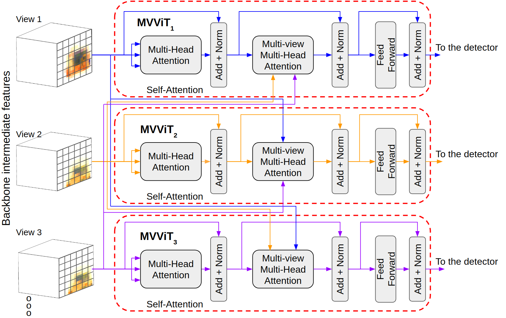

# MVViT
Multi-View Vision Transformers for ICPR 2022



## Overview

This is the code for **Multi-view Vision Transformers (MVViT)**, a Transformer-based 
network that combines features from multiple views to improve object detection. It is based on 
[MMDetection 2.15.1](https://github.com/open-mmlab/mmdetection/tree/v2.15.1), so in order to use it simply clone this
repository in the root folder where MMDetection was installed. All example commands in this repository are considered
to run from the root directory of MMDetection. 

## Dependencies
- Python 3.8
- Pytorch 1.7.1
- torchvision 0.8.2 
- MMDetection 2.15.1
- pycocotools 2.0.2
- numpy 1.20
- matplotlib 3.4.2
- opencv-python 4.5
- tqdm 4.62
- pillow 8.3.1

## Data preparation
Datasets must be in [COCO format](https://cocodataset.org/#format-data). A different annotations file must
be provided for each view, where the image id is the same for images from the same scene. These files are used in
the config files. 

A script to convert the [Wildtrack](https://www.epfl.ch/labs/cvlab/data/data-wildtrack/) dataset annotations into multi-view
coco annotations is provided in [tools/wildtrac2mvcoco.py](tools/wildtrac2mvcoco.py):

```
python MVViT/tools/wildtrack2mvcoco.py --anns-dir /path/to/wildtrack/dataset/annotation/annotations_positions --output-dir /path/to/output/dir
```

## Usage
Training and testing is done as usual in the MMDetection framework. New fields are added in the config files for multi-view 
YOLOv3 and Deformable DETR detectors, which are described next. 

To integrate MVViT to YOLOv3, the following classes were added:
- [MVViTDarknet](models/backbones/mvvit_darknet.py)
- [YOLOV3MVHead](models/dense_heads/mv_yolo_head.py)

For Deformable DETR, the new classes are:
- [MVViTResnet](models/backbones/mvvit_resnet.py)
- [MVChannelMapper](models/necks/mv_channel_mapper.py)
- [YOLOV3MVHead](models/dense_heads/mv_yolo_head.py)

Additionally, new datasets and pipelines focused in handling multi-view datasets are [provided](datasets).

#### Config files
For multi-view data loading, the following custom imports must be added:

```
'MVViT.datasets.pipelines.formatting',
'MVViT.datasets.pipelines.loading',
'MVViT.datasets.pipelines.test_time_aug',
'MVViT.datasets.pipelines.transforms',
'MVViT.datasets.coco_mv',
'MVViT.datasets.custom_mv'
```
The following changes must be done to the train and test pipelines (currently, RandomFlip is not supported):
- `LoadImageFromFile` -> `LoadMVImagesFromFile`
- `LoadAnnotations` -> `LoadMVAnnotations`
- `Pad` -> `MVPad`
- `Resize` -> `MVResize`
- `Normalize` -> `MVNormalize`
- `DefaultFormatBundle` -> `MVFormatBundle`
- `MultiScaleFlipAug` -> `MVMultiScaleFlipAug`
- `ImageToTensor` -> `MVImageToTensor`

Additionally, `dataset_type` must be set to `MVCocoDataset` and the `ann_file` must be changed to `ann_files` and
provide an ordered list of annotation files, each file corresponding to a view. 

##### YOLOv3 Detection
YOLOv3 uses the following custom imports:
```
'MVViT.models.backbones.mvvit_darknet',
'MVViT.models.dense_heads.mv_yolo_head'
```

The backbone must be changed from `Darknet` to `MVViTDarknet` with the following new fields:
- **combination_block**: where in the backbone the feature maps are combined via MVViT. If the passed value is less 
than -1, MVViT is not used. A value of -1 indicates a combination in the image space. For values greater than -1, the combination
block is the Darknet block before using the MVViT module. Default: -2
- **nhead**: number of heads used in MVViT. Default: 8
- **num_decoder_layers**: the number of decoders used in MVViT. Default: 1.
- **positional_encoding**: boolean indicating if positional encoding is used in MVViT. Default: True
- **views**: number of views.

Also, `YOLOV3Head` must be changed to `YOLOV3MVHead`.

##### Deformable DETR Detection
Similar to YOLOv3, the following custom imports must be added:
```
'MVViT.models.backbones.mvvit_resnet',
'MVViT.models.necks.mv_channel_mapper',
'MVViT.models.dense_heads.mv_deformable_detr_head',
```

The backbone must be changed from `ResNet` to `MVViTResNet` with the following new fields:
- **combination_block**: where in the backbone the feature maps are combined via MVViT. If the passed value is less 
than 0, MVViT is not used. A value of 0 indicates a combination in the image space. For values greater than 0, the combination
block is the ResNet block before using the MVViT module. Default: -1
- **nhead**: number of heads used in MVViT. Default: 8
- **num_decoder_layers**: the number of decoders used in MVViT. Default: 1.
- **positional_encoding**: boolean indicating if positional encoding is used in MVViT. Default: True
- **views**: number of views.

Also, `ChannelMapper` must be changed to `MVChannelMapper` and `DeformableDETRHead` to `MVDeformableDETRHead`.

#### Training
Training is carried out with the standard MMDetection script
```
python tools/train.py /path/to/config/file
```

#### Testing
We provide a multi-view testing script, similar to MMDetection file.
```
python MVViT/tools/test.py /path/to/config/file /path/to/checkpoint [same options for MMDetection test...]
```

## Results

| **Dataset** | **Architecture** | **Category** | **Method** | **AP**    | **AP_0.5** | **AP_0.75** | **AP_S**  | **AP_M**  | **AP_L**  | **AR**    | **AR_S**  | **AR_M**  | **AR_L**  |
|-------------|------------------|--------------|------------|-----------|------------|-------------|-----------|-----------|-----------|-----------|-----------|-----------|-----------|
| Wildtrack   | YOLOv3           | Person       | SV         | 0.297     | 0.631      | 0.235       | -         | **0.253**  | 0.319     | 0.414     | -         | **0.393**  | 0.428     |
|             |                  |              | MVViT      | **0.307** | **0.638**   | **0.252**    | -         | 0.244     | **0.338**  | **0.418**  | -         | 0.368     | **0.442** |
|             | Deformable DETR  | Person       | SV         | 0.369     | 0.727      | 0.328       | -         | 0.331     | 0.393     | 0.574     | -         | 0.551     | 0.584     |
|             |                  |              | MVViT      | **0.427**  | **0.782**   | **0.404**    | -         | **0.362**  | **0.454**  | **0.606**  | -         | **0.562**  | **0.622**  |
| X-ray-Dual  | YOLOv3           | Firearm      | SV         | 0.564     | 0.909      | 0.652       | -         | 0.563     | **0.668** | 0.617     | -         | 0.606     | 0.775     |
|             |                  |              | MVViT      | **0.585**  | **0.928**   | **0.694**    | -         | **0.591**  | 0.667     | **0.641**  | -         | **0.632**  | **0.779**  |
|             |                  | Knife        | SV         | 0.173     | 0.394      | **0.122**    | 0.050     | 0.200     | **0.034** | 0.214     | 0.065     | 0.225     | **0.225** |
|             |                  |              | MVViT      | **0.185**  | **0.459**  | 0.110       | **0.076** | **0.211** | 0.028     | **0.240**  | **0.094**  | **0.251**  | 0.175     |
|             |                  | Laptop       | SV         | **0.727** | **0.990**   | **0.868**   | -         | -         | **0.727**  | **0.772**  | -         | -         | **0.772** |
|             |                  |              | MVViT      | 0.720     | **0.990**   | **0.868**   | -         | -         | 0.720     | 0.769     | -         | -         | 0.769     |
|             |                  | Camera       | SV         | 0.510     | 0.781      | 0.596       | -         | **0.900**  | 0.505     | 0.550     | -         | **0.900**  | 0.545     |
|             |                  |              | MVViT      | **0.538**  | **0.841**   | **0.640**   | -         | **0.900**  | **0.534**  | **0.577**  | -         | **0.900**  | **0.572**  |
|             |                  | All          | SV         | 0.487     | 0.758      | 0.553       | 0.050     | 0.552     | 0.478     | 0.538     | 0.065     | 0.577     | **0.579**  |
|             |                  |              | MVViT      | **0.500** | **0.791**  | **0.570**    | **0.076**  | **0.566** | **0.480**  | **0.557** | **0.094** | **0.594**  | 0.574     |
|             | Deformable DETR  | Firearm      | SV         | **0.679** | 0.973      | 0.815       | -         | **0.687**  | 0.684     | **0.741**  | -         | **0.734**  | **0.832**  |
|             |                  |              | MVViT      | 0.671     | **0.974**  | **0.820**   | -         | 0.679     | **0.687**  | 0.734     | -         | 0.728     | 0.825     |
|             |                  | Knife        | SV         | **0.258**  | **0.640**  | **0.139**   | **0.124** | **0.293**  | 0.064     | **0.420** | **0.141**  | **0.440** | **0.500**  |
|             |                  |              | MVViT      | 0.253     | 0.634      | 0.133       | 0.109     | 0.289     | **0.153** | 0.410     | 0.129     | 0.433     | 0.275     |
|             |                  | Laptop       | SV         | 0.803     | 0.990      | 0.966       | -         | -         | 0.803     | 0.850     | -         | -         | 0.850     |
|             |                  |              | MVViT      | **0.838** | **1.000**  | **0.978**   | -         | -         | **0.838**  | **0.876** | -         | -         | **0.876**  |
|             |                  | Camera       | SV         | **0.678**  | **0.952**  | **0.841**   | -         | 0.700     | **0.679**  | **0.739** | -         | 0.700     | **0.740** |
|             |                  |              | MVViT      | 0.640     | 0.937      | 0.752       | -         | **0.900** | 0.638     | 0.720     | -         | **0.900**  | **0.717**  |
|             |                  | All          | SV         | **0.589**  | **0.864**   | **0.672**    | **0.124** | 0.556     | 0.544     | **0.687**  | **0.141**  | 0.625  | **0.731**     |
|             |                  |              | MVViT      | 0.586     | 0.861      | 0.658       | 0.108     | **0.618**  | **0.564**| 0.685     | 0.129     | **0.687**  | 0.673     |
| X-ray-Quad  | YOLOv3           | Firearm      | SV         | 0.650     | 0.940      | 0.813       | -         | 0.657     | 0.691     | 0.695     | -         | 0.688     | 0.767     |
|             |                  |              | MVViT      | **0.665** | **0.959**  | **0.821**    | -         | **0.670**  | **0.718**  | **0.708**  | -         | **0.699**  | **0.797**  |
|             |                  | Knife        | SV         | 0.260     | 0.556      | **0.189**    | **0.069**  | 0.289     | **0.026**  | 0.314     | 0.066     | 0.327     | 0.138     |
|             |                  |              | MVViT      | **0.268**  | **0.605**   | 0.176       | **0.069**  | **0.297** | 0.017     | **0.338** | **0.093** | **0.350**   | **0.163**  |
|             |                  | Laptop       | SV         | **0.786** | 0.980      | **0.943**    | -         | -         | **0.786**  | **0.823**  | -         | -         | **0.823**  |
|             |                  |              | MVViT      | 0.766     | **0.990**   | 0.930       | -         | -         | 0.766     | 0.810     | -         | -         | 0.810     |
|             |                  | Camera       | SV         | 0.571     | 0.850      | 0.671       | -         | 0.600     | 0.569     | 0.615     | -         | 0.600     | 0.615     |
|             |                  |              | MVViT      | **0.592 | **0.860**   | **0.723**   | -         | **0.700**  | **0.592** | **0.634** | -         | **0.700**  | **0.634**  |
|             |                  | All          | SV         | 0.561     | 0.823      | 0.648       | **0.069**  | 0.514     | 0.513     | 0.612     | 0.066     | **0.538**  | 0.586     |
|             |                  |              | MVViT      | **0.568** | **0.846**  | **0.657**   | **0.069**  | **0.555** | **0.518**  | **0.622**  | **0.093**  | **0.583**  | **0.601** |
|             | Deformable DETR  | Firearm      | SV         | **0.761** | **0.985**   | **0.926**    | -         | **0.769** | **0.775** | **0.808** | -         | **0.802**  | **0.880**  |
|             |                  |              | MVViT      | 0.733     | 0.984      | 0.885       | -         | 0.746     | 0.731     | 0.784     | -         | 0.779     | 0.837     |
|             |                  | Knife        | SV         | **0.375**  | **0.762**  | **0.326**    | 0.122     | **0.415** | 0.041     | **0.531** | **0.144** | **0.550** | **0.400**  |
|             |                  |              | MVViT      | 0.347     | 0.755      | 0.275       | **0.136** | 0.385     | **0.063**  | 0.504     | **0.144** | 0.521     | 0.362     |
|             |                  | Laptop       | SV         | 0.848     | **1.000**  | 0.988       | -         | -         | 0.848     | 0.887     | -         | -         | 0.887     |
|             |                  |              | MVViT      | **0.870** | 0.990      | **0.990**    | -         | -         | **0.870**  | **0.907** | -         | -         | **0.907** |
|             |                  | Camera       | SV         | **0.700**  | **0.963**   | **0.825**    | -         | 0.800     | **0.700**  | **0.760**  | -         | 0.800     | **0.760**  |
|             |                  |              | MVViT      | 0.681     | 0.953      | **0.825**   | -         | **0.900**| 0.680     | 0.753     | -         | **0.900**| 0.752     |
|             |                  | All          | SV         | **0.661** | **0.914**   | **0.755**    | 0.120     | 0.658     | **0.583**  | **0.747**  | **0.144**  | 0.717     | **0.732**  |
|             |                  |              | MVViT      | 0.648     | 0.904      | 0.732       | **0.135**  | **0.674**  | 0.577     | 0.737     | **0.144**  | **0.733** | 0.714     |

## Citation