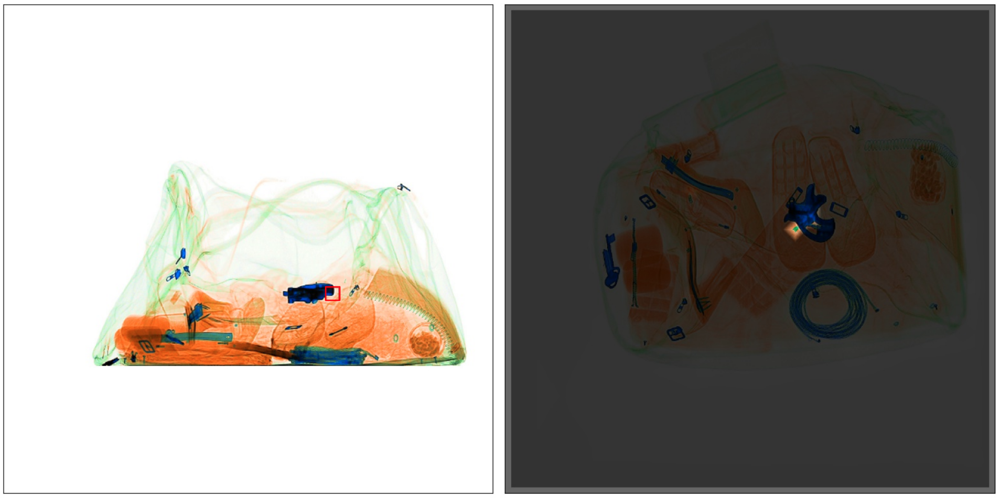

# MVViT
Multi-View Vision Transformers for ICPR 2022



## Overview

This is the code for **Multi-view Vision Transformers (MVViT)**, a Transformer-based 
network that combines features from multiple views to improve object detection. It is based on 
[MMDetection 2.15.1](https://github.com/open-mmlab/mmdetection/tree/v2.15.1), so in order to use it simply clone this
repository in the root folder where MMDetection was installed. All example commands in this repository are considered
to run from the root directory of MMDetection. 

## Dependencies
- Python 3.8
- Pytorch 1.7.1
- torchvision 0.8.2 
- MMDetection 2.15.1
- pycocotools 2.0.2
- numpy 1.20
- matplotlib 3.4.2
- opencv-python 4.5
- tqdm 4.62
- pillow 8.3.1

## Data preparation
Datasets must be in [COCO format](https://cocodataset.org/#format-data). A different annotations file must
be provided for each view, where the image id is the same for images from the same scene. These files are used in
the config files. 

A script to convert the [Wildtrack](https://www.epfl.ch/labs/cvlab/data/data-wildtrack/) dataset annotations into multi-view
coco annotations is provided in [tools/wildtrac2mvcoco.py](tools/wildtrac2mvcoco.py):

```
python MVViT/tools/wildtrack2mvcoco --anns-dir /path/to/wildtrack/dataset/annotation/annotations_positions --output-dir /path/to/output/dir
```

## Usage
Training and testing is done as usual in the MMDetection framework. New fields are added in the config files for multi-view 
YOLOv3 and Deformable DETR detectors, which are described next. 

#### Config files
#### Training
#### Testing

## Results

## Examples

## Citation